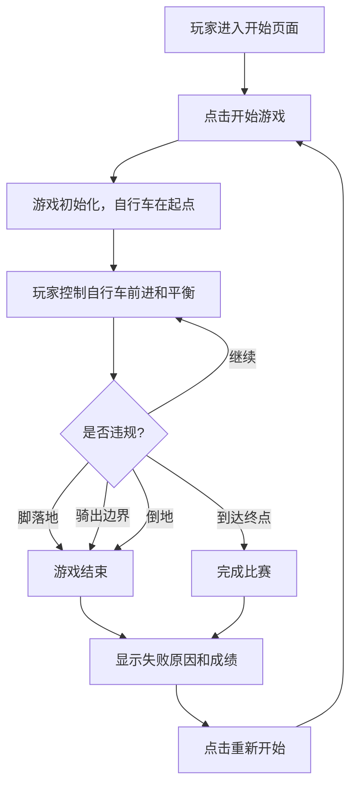

## 1. 产品概述

休闲自行车慢骑是一款考验玩家平衡感和耐心的小游戏。玩家需要控制自行车在狭窄的赛道上缓慢骑行，保持平衡不摔倒，用时最长者获胜。游戏融合了物理模拟和操作技巧，适合所有年龄段玩家休闲娱乐。

- 核心玩法：控制自行车平衡，越慢越好，不能倒地、不能脚落地、不能越界
- 目标用户：休闲游戏玩家，适合朋友聚会竞技

## 2. 核心 Features

### 2.1 用户角色

| 角色 | 注册方式 | 核心权限 |
|------|----------|----------|
| 玩家 | 无需注册 | 开始游戏、控制自行车、查看成绩 |

### 2.2 功能模块

1. **开始页面**：游戏标题、开始按钮、操作说明
2. **游戏页面**：赛道场景、自行车、平衡指示器、计时器、速度显示
3. **结束页面**：最终成绩、重新开始按钮、排行榜

### 2.3 页面详情

| 页面名称 | 模块名称 | 功能描述 |
|---------|----------|----------|
| 开始页面 | 标题区域 | 展示游戏名称和主题视觉 |
| 开始页面 | 操作说明 | 键盘控制方式（左右键平衡，前进踏板） |
| 开始页面 | 开始按钮 | 点击进入游戏 |
| 游戏页面 | 游戏画布 | Canvas 渲染侧视赛道和自行车 |
| 游戏页面 | 平衡指示器 | 显示当前平衡状态（左右倾斜角度） |
| 游戏页面 | 计时器 | 实时显示骑行时长 |
| 游戏页面 | 速度显示 | 显示当前骑行速度 |
| 游戏页面 | 警告提示 | 脚落地/越界/倒地警告 |
| 结束页面 | 成绩展示 | 显示最终用时和失败原因 |
| 结束页面 | 重新开始 | 重新开始游戏 |
| 结束页面 | 排行榜 | 显示历史最佳成绩 |

## 3. 核心流程

## 4. 用户界面设计

### 4.1 设计风格

- **主色调**：清新自然的绿色系（#4CAF50），代表草地和户外活动
- **辅助色**：天空蓝（#87CEEB）、土黄色（#D2B48C）代表赛道
- **按钮风格**：圆角矩形，悬停时有缩放和阴影效果
- **字体**：标题使用 "ZCOOL KuaiLe" 活泼字体，正文使用 "Noto Sans SC"
- **布局风格**：居中布局，游戏画布为视觉焦点
- **图标风格**：简洁的线性图标，使用 emoji 增强趣味性

### 4.2 页面设计概览

| 页面名称 | 模块名称 | UI 元素 |
|---------|----------|----------|
| 开始页面 | 标题区域 | 大号字体标题，自行车图标，渐变背景 |
| 开始页面 | 操作说明 | 卡片式布局，键盘图标配合文字说明 |
| 开始页面 | 开始按钮 | 大尺寸绿色按钮，呼吸动画效果 |
| 游戏页面 | 游戏画布 | 侧视视角，天空渐变背景，绿色草地，土黄色赛道 |
| 游戏页面 | HUD 界面 | 左上角计时器，右上角速度，底部平衡条 |
| 游戏页面 | 警告提示 | 红色闪烁提示文字 |
| 结束页面 | 成绩卡片 | 半透明玻璃态效果，大号数字显示成绩 |
| 结束页面 | 排行榜 | 列表形式，前三名高亮显示 |

### 4.3 响应式设计

- 桌面端优先，游戏画布固定比例（16:9）
- 移动端自适应，触控按钮替代键盘操作
- 支持横屏和竖屏显示

### 4.4 游戏场景设计

- **环境**：晴朗蓝天，白云飘动，两侧草地
- **赛道**：窄窄的土黄色路径，有轻微的纹理质感
- **自行车**：简洁的线条绘制，可见车轮、车架、脚踏
- **动画**：车轮转动，脚踏运动，车身倾斜效果，平衡时轻微晃动
