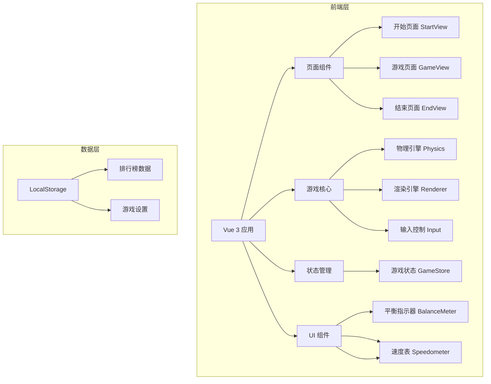

## 1. 架构设计



## 2. 技术描述

- **前端框架**: Vue 3 + TypeScript + Composition API
- **构建工具**: Vite 5
- **样式方案**: Tailwind CSS 3
- **路由管理**: Vue Router 4
- **状态管理**: Pinia
- **渲染技术**: HTML5 Canvas 2D
- **数据存储**: LocalStorage（本地存储排行榜）

## 3. 目录结构

```
src/
├── components/          # 可复用组件
│   ├── BalanceMeter.vue    # 平衡指示器
│   ├── GameCanvas.vue      # 游戏画布
│   ├── Timer.vue           # 计时器
│   └── Speedometer.vue     # 速度表
├── composables/         # 组合式函数
│   ├── useGamePhysics.ts   # 游戏物理引擎
│   ├── useGameRenderer.ts  # 游戏渲染引擎
│   └── useGameInput.ts     # 输入控制
├── stores/              # Pinia 状态管理
│   └── gameStore.ts        # 游戏状态
├── views/               # 页面视图
│   ├── StartView.vue       # 开始页面
│   ├── GameView.vue        # 游戏页面
│   └── EndView.vue         # 结束页面
├── router/              # 路由配置
│   └── index.ts
├── types/               # TypeScript 类型定义
│   └── game.ts
├── utils/               # 工具函数
│   └── storage.ts          # 本地存储工具
├── App.vue
└── main.ts
```

## 4. 路由定义

| 路由路径 | 页面组件 | 功能说明 |
|---------|----------|----------|
| `/` | StartView | 游戏开始页面 |
| `/game` | GameView | 游戏主页面 |
| `/end` | EndView | 游戏结束页面 |

## 5. 游戏核心数据模型

### 5.1 自行车状态

```typescript
interface BikeState {
  x: number           // X 轴位置（赛道位置）
  y: number           // Y 轴位置（垂直位置）
  angle: number       // 倾斜角度（-90 到 90 度，0 为垂直）
  speed: number       // 前进速度
  angularVelocity: number  // 角速度（倾斜变化率）
  pedalRotation: number    // 脚踏旋转角度
  frontWheelRotation: number // 前轮旋转角度
  backWheelRotation: number  // 后轮旋转角度
}
```

### 5.2 游戏状态

```typescript
interface GameState {
  status: 'idle' | 'playing' | 'ended'
  bike: BikeState
  track: TrackConfig
  time: number        // 已用时间（秒）
  distance: number    // 已行进距离
  isFootDown: boolean // 是否脚落地
  isOutOfTrack: boolean // 是否越界
  isFallen: boolean   // 是否倒地
  failReason?: string // 失败原因
}
```

### 5.3 赛道配置

```typescript
interface TrackConfig {
  width: number       // 赛道宽度
  length: number      // 赛道总长度
  startX: number      // 起点 X 坐标
  groundY: number     // 地面 Y 坐标
}
```

### 5.4 物理参数

```typescript
interface PhysicsConfig {
  gravity: number     // 重力加速度
  balanceForce: number // 平衡恢复力
  maxSpeed: number    // 最大速度
  minSpeed: number    // 最小速度（低于则更易失去平衡）
  fallAngle: number   // 倒地角度阈值
  friction: number    // 摩擦力
  pedalForce: number  // 踏板推进力
}
```

### 5.5 排行榜记录

```typescript
interface LeaderboardEntry {
  id: string
  time: number        // 用时（秒）
  distance: number    // 完成距离
  date: string        // 记录日期
  isCompleted: boolean // 是否完成全程
}
```

## 6. 游戏控制逻辑

### 6.1 键盘控制

| 按键 | 功能 |
|------|------|
| ← 左箭头 | 向左平衡（减小倾斜角度） |
| → 右箭头 | 向右平衡（增大倾斜角度） |
| ↑ 上箭头 / 空格键 | 踩踏板加速 |
| R | 重新开始 |

### 6.2 触控控制

- 左侧区域触摸：向左平衡
- 右侧区域触摸：向右平衡
- 底部按钮：踩踏板加速

### 6.3 游戏循环

1. **输入处理**：采集键盘/触控输入
2. **物理更新**：
   - 根据输入更新倾斜角度和速度
   - 应用重力和摩擦力
   - 计算平衡状态
   - 检测违规（脚落地、越界、倒地）
3. **渲染更新**：
   - 绘制背景（天空、草地）
   - 绘制赛道
   - 绘制自行车
   - 更新 UI 显示
4. **状态判断**：
   - 检查游戏是否结束
   - 更新计时器
   - 检查是否到达终点

## 7. 违规判定条件

1. **倒地**：倾斜角度超过 ±45 度
2. **脚落地**：速度为 0 持续超过 2 秒
3. **越界**：自行车位置超出赛道边界
4. **到达终点**：行进距离达到赛道总长度
